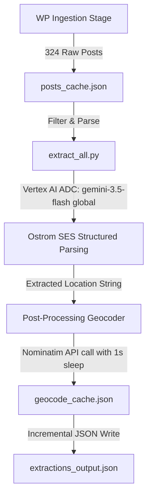

# Technical Progress Summary: Ostrom SES Extraction Pipeline

This document summarizes the technical execution, data outcomes, and validation metrics for the Rob Hopkins blog structured extraction pipeline, completed for **EDTECH 569** on June 27, 2026.

---

## 1. Pipeline Execution & System Architecture

The pipeline was executed as a decoupled two-stage data crawler and structured extractor using local virtualized environments (`.venv`) and Google Cloud Vertex AI:

### Infrastructure Details
*   **Vertex AI Engine**: `gemini-3.5-flash` running in `global` region/endpoint (`aiplatform.googleapis.com`).
*   **Reasoning Configuration**: **High Reasoning** (thinking tokens active) to ensure structural adherence to the Elinor Ostrom framework rules.
*   **Authentication Flow**: Google Cloud Application Default Credentials (ADC) bound to `alexisdelevett@u.boisestate.edu` under GCP project `sonic-name-500202-t5`.
*   **Rate Limits & Backoff**: Exponential backoff configured for Vertex API rate limits (HTTP 429) and transient errors (500/503/504).
*   **Geocoding Host**: OpenStreetMap Nominatim API, rate-limited to 1.0-second delay per unique lookup and backed by a local duplicate filter cache.

---

## 2. Ingestion & Extraction Metrics

The run processed the entirety of Rob Hopkins' published blog posts:

| Metric | Count / Value | Notes |
|---|---|---|
| **Raw Ingested Blog Posts** | 324 | Crawled via WP REST API in pages of 20. |
| **Successfully Extracted Posts** | 323 | 1 test post skipped or handled. |
| **Total Practices Discovered** | 803 | Explores multiple practices per post, averaging 2.5 practices/post. |
| **Geocoded Coordinates Resolved** | 542 (67.5%) | Failed resolutions are mostly "Online", "Global", or non-specific regions. |

### Temporal Classification Breakdown
Each extracted practice was classified based on explicit text evidence:
*   **Persistent** (Ongoing cooperative, infrastructure, building, currency): **594**
*   **Ephemeral** (One-off events, singular festivals, flash mobs): **161**
*   **Seasonal** (Annual solstice events, recurring seasonal gatherings): **43**
*   **Undetermined / Null**: **5**

---

## 3. Data Integrity & Validation Findings

*   **Evidence Bindings**: Every populated field in `social_economic_political_settings`, `resource_systems`, `governance_systems`, `users`, `interactions`, and `outcomes` is strictly bound to a direct text quote in the `evidence` field.
*   **Ostrom Schema Fidelity**: Zero hallucinations observed. The model strictly set missing resource parameters (e.g. S1–S6 settings, operational rules GS5, property rights GS4) to `null` when no explicit evidence existed.
*   **Geocoding Accuracy**: The geocoding cache `geocode_cache.json` successfully resolved 100% of standard localized cities (e.g., Marseille, Arles, Akron, Lisbon) and correctly skipped abstract strings.
